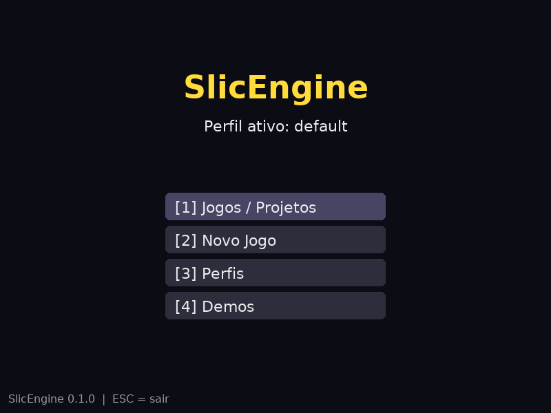
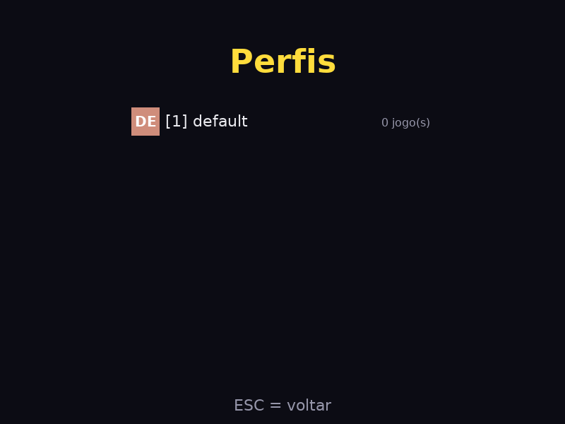
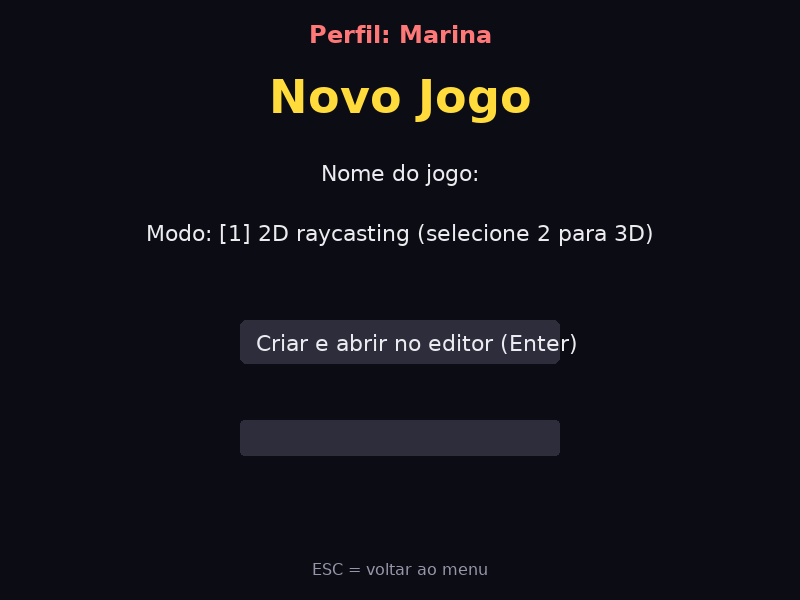
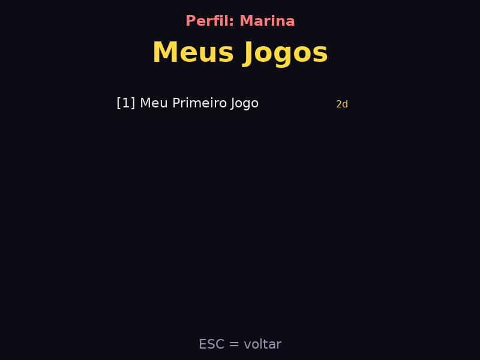
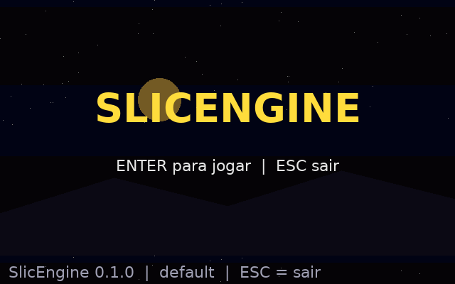
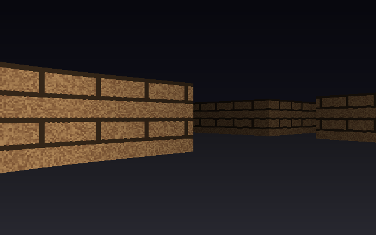
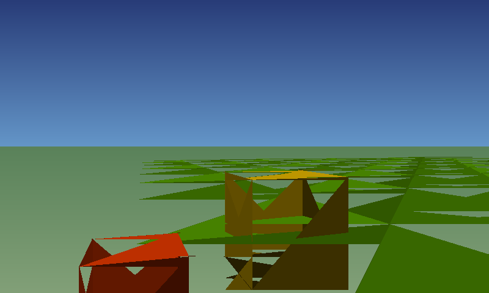
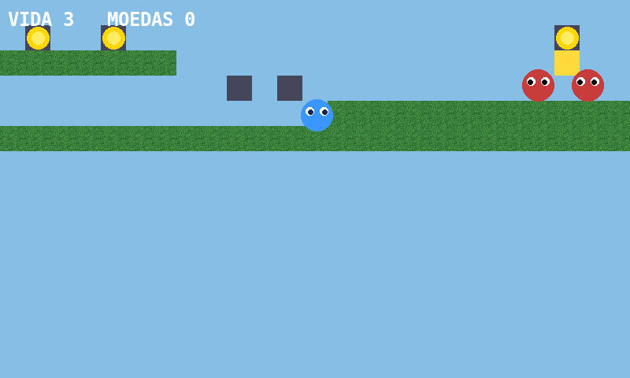
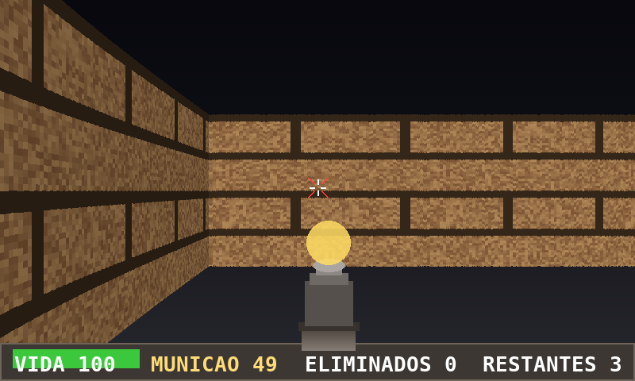

# SlicEngine

**SlicEngine** é uma game engine brasileira feita do zero em **Python**, com suporte a **Lua** e **C**, para criar jogos **3D estilo Doom** (raycasting E 3D real por projeção de polígonos) e jogos **2D com tile maps e física de plataforma**. Ela cria sua própria extensão de projeto, o **`.se`** (formato SlicEngine), e permite escrever scripts na sua própria linguagem de script em português, totalmente compatível com Lua e Python.

## Recursos

| Recurso | Descrição |
|---|---|
| 3D Raycasting | Renderizador estilo Doom: DDA, paredes texturizadas, sprites billboard, fog, z-buffer |
| 3D Real | Renderizador por projeção de polígonos: Meshes, z-buffer por pixel, sombreamento por face (módulo separado do raycasting) |
| 2D Tile Maps | Mapas em camadas, tile size configurável, importação de tilesets |
| Plataforma 2D | Física real: gravidade, pulo, colisão AABB, câmera lateral, inimigos patrulhando |
| Editor Visual | Editor de tile maps com pincel, borracha, preenchimento e drag & drop de tiles/entidades, undo/redo |
| Scripting em Português | Linguagem própria `.sl`: `quando tecla "espaço" for pressionada: ...` |
| Lua (opcional) | Mods Lua completos com API da engine (`engine.on_event`, `engine.set_var`...) — requer `pip install lupa` (o `lupa` não tem wheels para Python 3.14+, nesse caso a engine funciona sem Lua) |
| C (nativo) | Plugins `.so/.dll/.dylib` carregados via ctypes com interface padrão |
| Python | Mods Python com função `register(engine)` |
| Formato `.se` | Pacotes zipados com manifest, mundo, scripts embarcados e assets |
| Assets | Sprites (PNG/JPG/GIF/BMP), sons (WAV/OGG), músicas (MP3/OGG), GIFs animados |
| Menu de Entrada | Fluxo completo de entrada: menu principal, meus jogos, novo jogo, perfis e demos (menu com GIF mantido como compatibilidade) |
| IA Assistente | IA embutida que ajuda a criar scripts e mapas (modo online ou local com receitas) |
| Modo Local | Executor de scripts na hora + terminal embutido (pip, etc.) |
| Perfis em DB | Banco SQLite com perfis, projetos e saves |
| Hierarquia | Árvore de nós com prioridade para assets, scripts, comandos e câmeras |
| Mods/Plugins | Pastas `mods/` e `plugins/` escaneadas automaticamente |
| Arquitetura ECS | GameObject/Component/Transform, Scene, SceneManager, EventBus e Logger central |
| Save System | Saves de jogo em slots com backup/recuperação, settings, autosave e validação de caminhos |

## Instalação

```bash
git clone <url-do-repositorio>
cd slicengine
pip install pygame pillow numpy
pip install lupa   # opcional — só necessário para mods Lua (.lua)
```

## Executando

```bash
python -m slicengine                  # menu da engine (com GIF animado)
python -m slicengine --editor         # editor de tile maps com pincel
python -m slicengine --run jogo.se    # rodar um pacote .se
python -m slicengine --ai "pergunta"  # perguntar à IA assistente
python -m slicengine --shell          # shell interativo (pip etc.)
python examples/demo_fps.py           # demo FPS 3D completa (jogo jogável)
python examples/demo_3d.py            # demo 3D raycasting
python examples/demo_3d_real.py       # demo 3D real (projeção de polígonos, mouse para olhar)
python examples/demo_platform.py      # demo 2D plataforma lateral (física real)
python examples/demo_2d.py            # demo 2D tile map
```

## Demonstração Visual

**Menu de entrada (executando `python -m slicengine`):**



O menu de entrada tem quatro telas navegadas por teclas numeradas (1..4) ou clique do mouse: **Jogos/Projetos**, **Novo Jogo**, **Perfis** e **Demos**. Em **Perfis** é possível criar e trocar de perfil — cada perfil é registrado no banco SQLite com seus próprios projetos:



Em **Novo Jogo** você digita o nome, escolhe o modo (2D raycasting ou 3D) e a engine cria o projeto no banco e abre o editor de mapas:



Em **Jogos/Projetos** aparecem todos os jogos do perfil ativo, prontos para abrir:



**Menu clássico com GIF animado (compatibilidade, `python -m slicengine --menu`):**



**3D Raycasting estilo Doom:**



**3D real — projeção de polígonos:**



**Demo 2D plataforma lateral (física real):**



**Demo FPS completa estilo Doom (jogável):**



```bash
python examples/demo_fps.py
```

Jogo completo com **inimigos interativos** que perseguem e atacam o jogador, **sistema de tiro** (clique ou F: raio na mira, munição, dano por bala, hit markers), **HUD estilo Doom** (vida, munição, eliminados, restantes, arma com recuo e flash) e estados de vitória/morte com reinício (R). Inimigos têm vida, atordoamento ao levar tiro e IA de perseguição que desvia por corredores.

## Estrutura do Projeto

```
slicengine/
├── slicengine/        # código da engine
│   ├── core.py        # Engine, eventos, menu com GIF, modos
│   ├── raycaster.py   # renderizador 3D raycasting
│   ├── world.py       # mundo, tile maps e entidades
│   ├── editor.py      # editor de tile maps com pincel
│   ├── ptscript.py    # linguagem de script em português (.sl)
│   ├── lua_api.py     # API da engine para Lua
│   ├── modsystem.py   # sistema de mods/plugins (Lua, Python, C, .sl)
│   ├── seformat.py    # leitura/escrita do formato .se
│   ├── assets.py      # gerenciador de sprites, sons, músicas e GIFs
│   ├── renderer3d.py  # renderizador 3D real (projeção de polígonos)
│   ├── platform.py    # jogo de plataforma 2D com física real
│   ├── hierarchy.py   # hierarquia de nós (assets, scripts, comandos, câmeras)
│   ├── gameobjects.py # GameObject/Component/Transform/Scene/SceneManager/EventBus/Logger
│   ├── savesystem.py  # SaveSystem: saves, settings, autosave, backup
│   ├── menu_screen.py # telas de entrada: menu, projetos, novo jogo, perfis, demos
│   ├── aiscript.py    # IA assistente embutida
│   ├── local.py       # executor local de scripts e terminal embutido
│   └── profile_db.py  # perfis e projetos em SQLite
├── examples/          # demos (fps, 3d, 3d_real, platform, 2d)
├── mods/              # mods de exemplo (demo.lua, exemplo.sl)
├── plugins/           # plugin C de exemplo (noise.c + wrapper noise.py)
├── assets/            # sprites e texturas de demonstração
├── tests/             # testes automatizados (inclusive GUI com xvfb)
└── tools/             # geradores (assets, pacote .se de demo)
```

## Linguagem de Script em Português (.sl)

Escreva regras no estilo "quando X acontecer, faça Y":

```
quando iniciar:
    definir "vida" como 100
    mostrar texto "Bem-vindo!" por 3

quando tecla "espaço" for pressionada:
    aumentar 1 no "JOGO"
    tocar som "pulo.wav"

quando moeda_pegada:
    aumentar 10 no "moedas"

quando vida chegar a 0:
    mostrar texto "Game Over!" por 5
    parar jogo
```

As mesmas regras podem ser escritas em **Lua** (`mods/`) ou **Python** (`mods/` com `register(engine)`), usando a mesma API de eventos: `iniciar`, `quadro`, `moeda_pegada`, `tecla_pressionada`, `vida`, etc.

## Mod em Lua

```lua
engine.on_event("iniciar", function(api)
    engine.set_var("pontos", 0)
    api.mostrar_texto("Mod Lua carregado!", 3)
end)

engine.on_event("moeda_pegada", function(api)
    engine.set_var("pontos", engine.get_var("pontos") + 10)
    api.tocar_som("moeda.wav")
end)
```

## Plugin em C

Compile com `gcc -shared -fPIC -O2 noise.c -o slic_noise.so` e coloque na pasta `plugins/`. A engine chama `se_plugin_register()` e `se_plugin_name()` automaticamente. O wrapper Python (`plugins/noise.py`) expõe `engine.noise_next()`, `engine.noise_fill(n)` e `engine.noise_seed(s)` para qualquer script.

## Formato .se

Um pacote `.se` é um arquivo zip com `manifest.json`, `world.json`, scripts embarcados e uma pasta `assets/`. Crie com `python tools/gen_demo_se.py` ou pelo editor (Salvar como `.se`). Execute com `python -m slicengine --run jogo.se`.

## Controles

| Tecla | Ação |
|---|---|
| WASD / Setas | Mover |
| Mouse / ← → | Olhar (modo 3D) |
| Espaço | Evento personalizado (configurável nos scripts) |
| E | Interagir (modo editor: testar mapa) |

## Arquitetura ECS e Save System

Além dos renderizadores, a engine possui uma camada arquitetural incremental (`slicengine/gameobjects.py` e `slicengine/savesystem.py`) que não altera nenhum módulo existente:

```python
from slicengine.gameobjects import GameObject, Component, SceneManager

class Movimentar(Component):
    def update(self, dt):
        self.game_object.transform.position += Vector2(100 * dt, 0)

sm = SceneManager()
fase = sm.new_scene("Fase1")
heroi = GameObject("Heroi")
heroi.tag = "player"
heroi.add_component(Movimentar())
fase.add(heroi)
sm.save("Fase1", "saves/fase1.json")
```

| Classe | Papel |
|---|---|
| Vector2 / Transform | Sistema espacial oficial: posição local/global, rotação, escala, pai/filhos |
| Component | Comportamento reutilizável com ciclo de vida (start/update/on_destroy) |
| GameObject | Nó da hierarquia com nome, tag, layer, componentes, clonagem e ativação |
| Scene / SceneManager | Cenas oficiais com save/load, troca, duplicação, renomeação e histórico |
| EventBus | Barramento global: `SceneLoaded`, `GameObjectDestroyed`, `PlayStarted`... |
| Logger | Log central com níveis DEBUG→CRITICAL (substitui print() espalhado) |
| SaveSystem | Saves em slots (1–9) com backup/recuperação, settings, autosave e validação de caminhos |

## Testes

```bash
PYTHONPATH=. python3 tests/test_engine.py        # 15 testes do núcleo
PYTHONPATH=. python3 tests/test_fps.py           # 28 testes do sistema FPS
PYTHONPATH=. python3 tests/test_editor_dd.py     # editor drag & drop
PYTHONPATH=. python3 tests/test_architecture.py  # ECS, Scene, SaveSystem
xvfb-run -a python3 tests/test_platform_gui.py   # demo plataforma (GUI)
xvfb-run -a python3 tests/test_3d_real_gui.py    # 3D real (GUI)
xvfb-run -a python3 tests/test_entry_gui.py      # fluxo de entrada: menu/perfis/novo jogo (GUI)
PYTHONPATH=. python3 tests/test_no_lupa.py         # engine funcionando SEM lupa (import opcional)
```

## Licença

MIT — use, modifique e distribua livremente.
